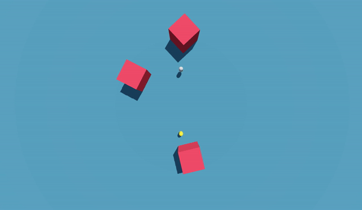

# Chase Around

Simple top down running game where an enemy constantly tracks you.

## To run
1. Run command `git clone https://github.com/AnarchistHoneybun/chase-around.git`
2. Install Godot 4.2.1
3. Open the git repo as project in Godot
4. Run the scene (use W,A,S,D to move around, Space-bar to jump)

